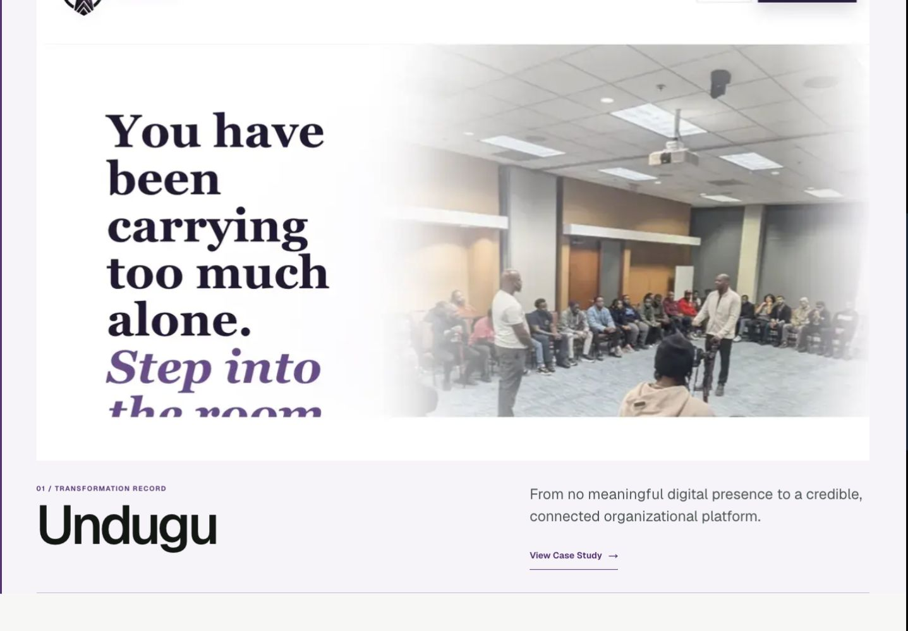
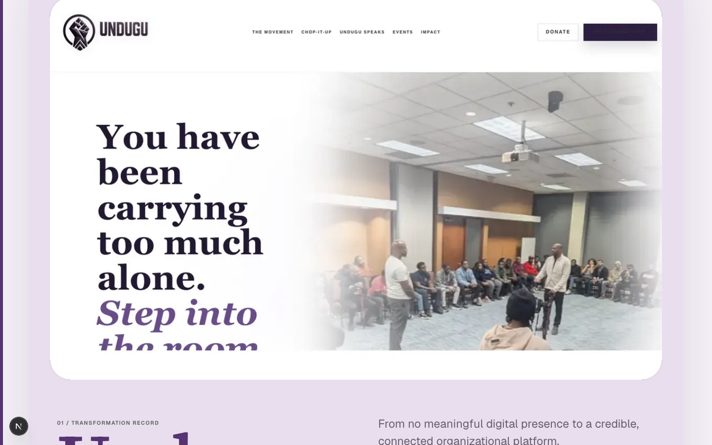
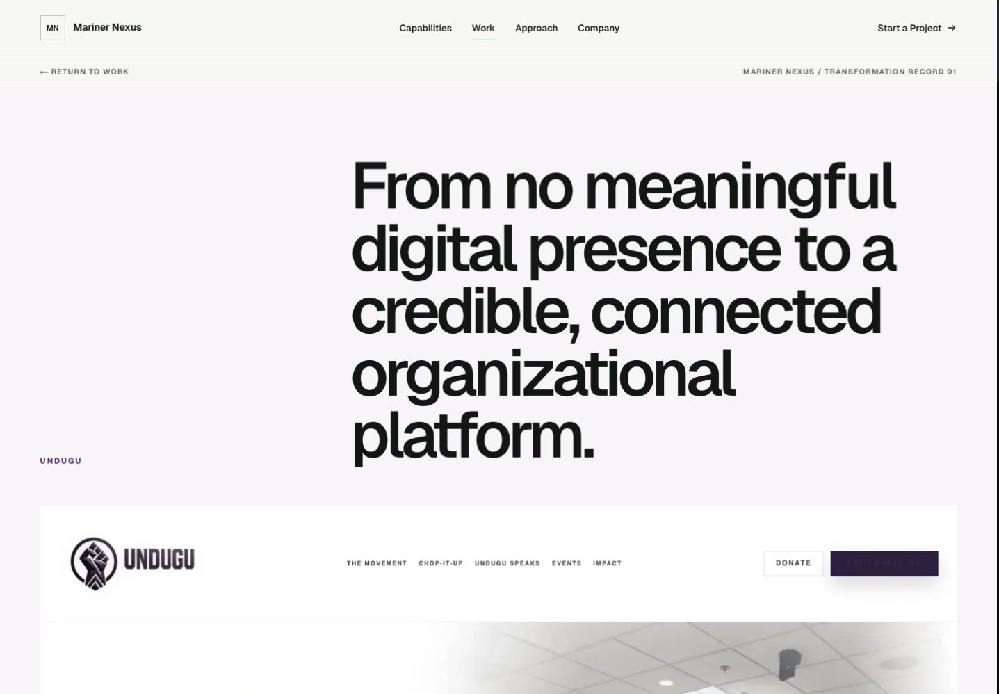
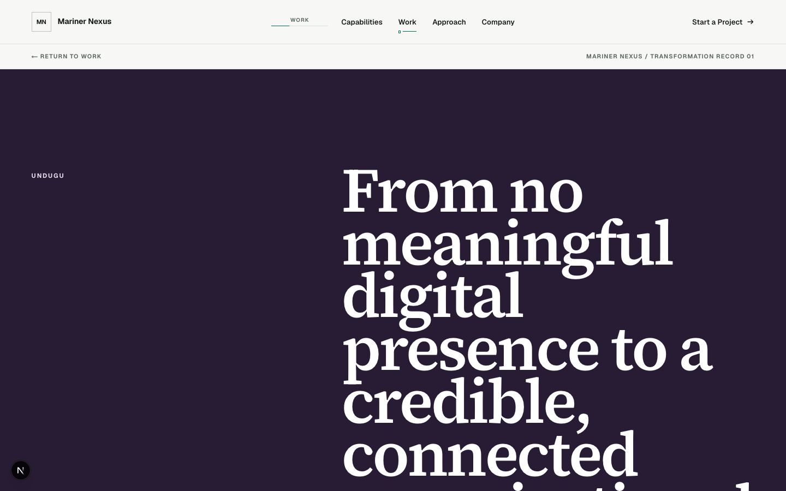
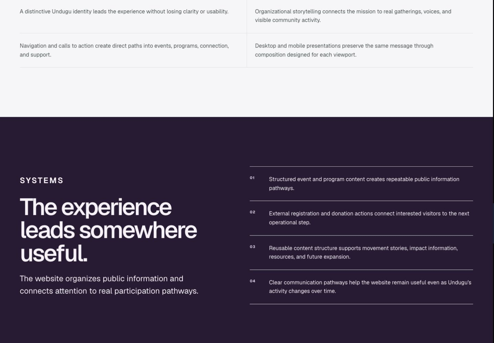
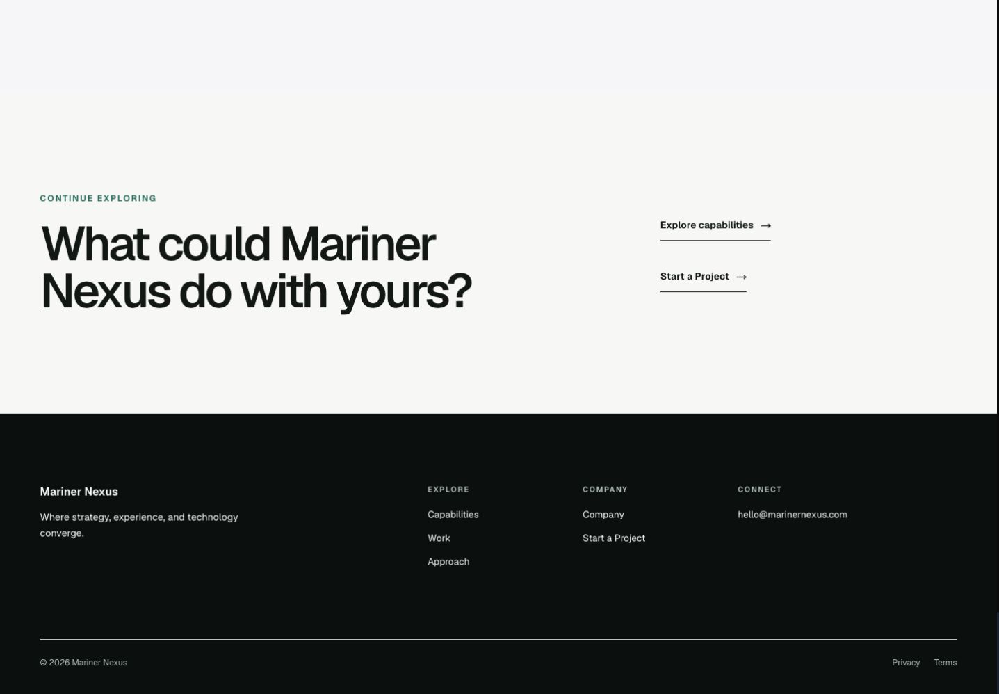
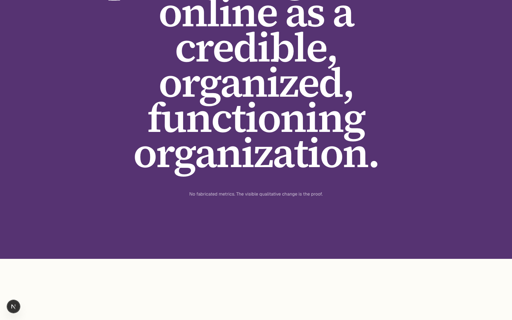

# EA-01 direct comparison

The left column is the approved Phase 04A baseline. The right column is the EA-01 Client Takeover Engine at the same experience moments.

| Before — palette-led identity | After — full experience takeover |
| --- | --- |
|  |  |
|  |  |
|  |  |
|  |  |
