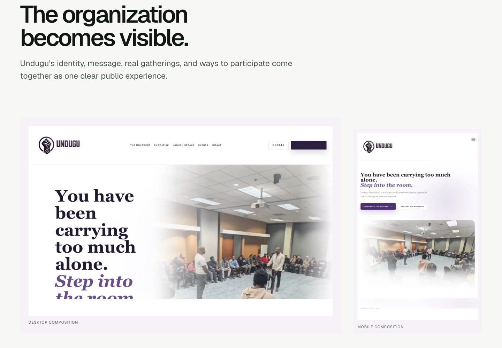
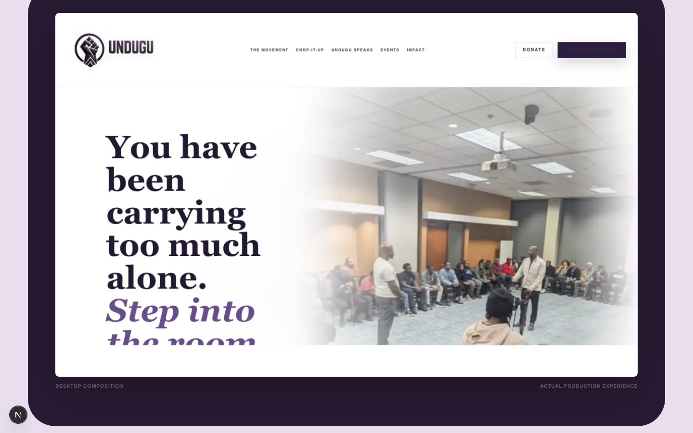
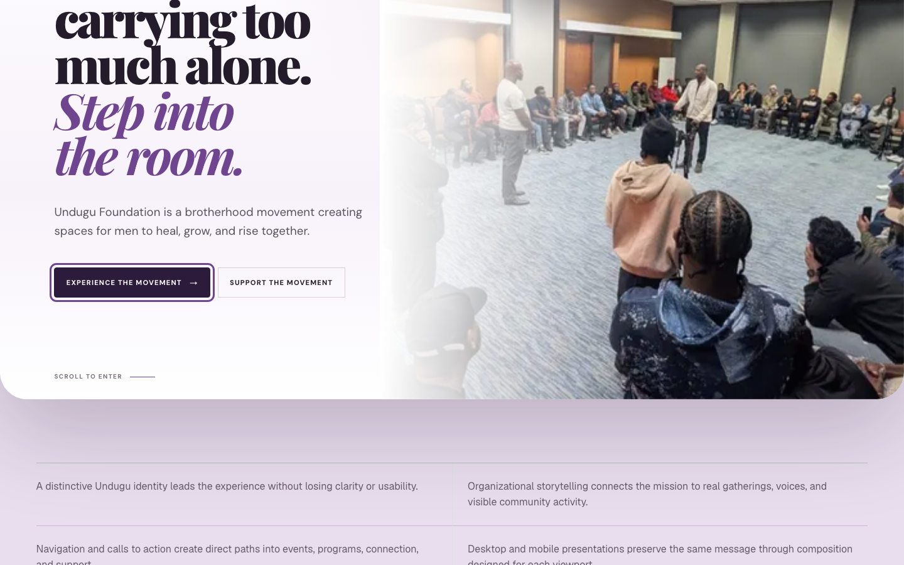

# Undugu proof progression

| Before EA-01 — screenshot proof | EA-01 — client takeover with screenshot proof | EA-02 — Living Interface |
| --- | --- | --- |
|  |  |  |

EA-02’s text, navigation, buttons, focus state, responsive composition, and mobile disclosure are live semantic elements. The first two states remain raster proof.
